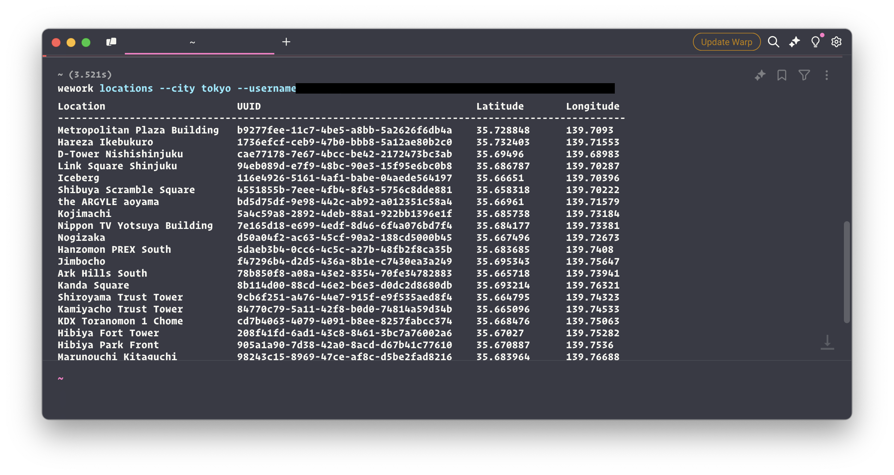

# BookWeWork

wework is a CLI tool for booking WeWork spaces.



## Installation

You can install wework directly from GitHub using pip:


```
go install github.com/dvcrn/wework-cli/cmd/wework@latest
```


## Usage

After installation, you can use the `wework` command in your terminal:


wework [action] [date] [options]


Available actions:
- `book`: Book a WeWork space
- `desks`: List available desks
- `locations`: List WeWork locations in a city
- `calendar`: Generate an iCalendar (.ics) file containing your WeWork bookings

Options:
- `--location-uuid`: Location UUID for booking (optional for 'book' action)
- `--city`: City name (required for 'locations' action, optional for 'book' action)
- `--name`: Space name (optional for 'book' action, requires --city)
- `--username`: Username (required if WEWORK_USERNAME env var is not set)
- `--password`: Password (required if WEWORK_PASSWORD env var is not set)

Authentication can be provided either through command line arguments or environment variables:


export WEWORK_USERNAME=your_username
export WEWORK_PASSWORD=your_password


Examples:

1. List locations in a city:
   
   wework locations --city "New York" --username your_username --password your_password
   # Or using environment variables:
   wework locations --city "New York"
   

2. List available desks for a date:
   
   wework desks 2023-06-01 --location-uuid YOUR_LOCATION_UUID --username your_username --password your_password
   

3. Book a space:
   
   wework book 2023-06-01 --location-uuid YOUR_LOCATION_UUID --username your_username --password your_password
   
   # Or using city and name:
   wework book 2023-06-01 --city "New York" --name "WeWork Times Square" --username your_username --password your_password
   

Note: You can book multiple dates by using a date range or comma-separated list:
   
   wework book 2023-06-01~2023-06-05 --location-uuid YOUR_LOCATION_UUID --username your_username --password your_password
   wework book 2023-06-01,2023-06-03,2023-06-05 --location-uuid YOUR_LOCATION_UUID --username your_username --password your_password
   

You can also use the `--city` option with the `desks` action to list available desks in a specific city:


wework desks 2023-06-01 --city "New York" --username your_username --password your_password


4. List your upcoming bookings:
   
   wework bookings --username your_username --password your_password
   

5. Generate a calendar file for importing into calendar apps:
   
   wework calendar --username your_username --password your_password
   

For more information on available options, use:


wework --help


## Development

To set up the development environment:

1. Clone the repository
2. Install the dependencies: `pip install -r requirements.txt`
3. Make your changes
4. Run tests (if available)
5. Submit a pull request

## License

This project is licensed under the MIT License.
