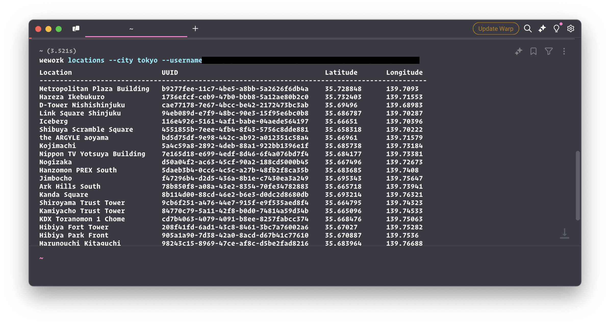

# BookWeWork

wework is a CLI tool for booking WeWork spaces.



## Installation

### With npm

```bash
npm install -g wework-cli
```

### With mise

```bash
mise use -g go:github.com/dvcrn/wework-cli/cmd/wework@latest
```

### With Go

```bash
go install github.com/dvcrn/wework-cli/cmd/wework@latest
```

## Agent Installation

For Claude Desktop, add `dvcrn/wework-cli` as a marketplace plugin, then install the `wework` plugin from that marketplace.

For Claude Code, the equivalent commands are:

```bash
claude plugins marketplace add dvcrn/wework-cli
claude plugins install wework@dvcrn-wework-cli --scope user
```

For `npx skills`, run:

```bash
npx skills add dvcrn/wework-cli
```

## Usage

After installation, you can use the `wework` command in your terminal:

```bash
wework [action] [date] [options]
```

Available actions:

- `book`: Book a WeWork space
- `desks`: List available desks
- `locations`: List WeWork locations in a city
- `favorites`: Manage favorite locations (list, add, remove)
- `print`: Manage print queue and upload print jobs
- `calendar`: Generate an iCalendar (.ics) file containing your WeWork bookings
- `me`: Get your profile information

Options:

- `--location-uuid`: Location UUID for booking (optional for 'book' action)
- `--city`: City name (required for 'locations' action, optional for 'book' action)
- `--name`: Space name (optional for 'book' action, requires --city)
- `--username`: Username (can be set via WEWORK_USERNAME env var)
- `--password`: Password (can be set via WEWORK_PASSWORD env var)
- `--include-bootstrap`: Include bootstrap data (optional for 'me' action)

Authentication can be provided either through command line arguments or environment variables:

```bash
export WEWORK_USERNAME=your_username
export WEWORK_PASSWORD=your_password
```

Examples:

1. List locations in a city:

   ```bash
   wework locations --city "New York" --username your_username --password your_password

   # Or using environment variables:
   wework locations --city "New York"
   ```

2. List available desks for a date:

   ```bash
   wework desks 2026-06-01 --location-uuid YOUR_LOCATION_UUID --username your_username --password your_password
   ```

3. Book a space:

   ```bash
   wework book 2026-06-01 --location-uuid YOUR_LOCATION_UUID --username your_username --password your_password

   # Or using city and name:
   wework book 2026-06-01 --city "New York" --name "WeWork Times Square" --username your_username --password your_password
   ```

   Note: You can book multiple dates by using a date range or comma-separated list:

   ```bash
   wework book 2026-06-01~2026-06-05 --location-uuid YOUR_LOCATION_UUID --username your_username --password your_password
   wework book 2026-06-01,2026-06-03,2026-06-05 --location-uuid YOUR_LOCATION_UUID --username your_username --password your_password
   ```

   You can also use the `--city` option with the `desks` action to list available desks in a specific city:

   ```bash
   wework desks 2026-06-01 --city "New York" --username your_username --password your_password
   ```

4. List your upcoming bookings:

   ```bash
   wework bookings --username your_username --password your_password
   ```

5. Generate a calendar file for importing into calendar apps:

   ```bash
   wework calendar --username your_username --password your_password
   ```

6. Show profile information:

   ```bash
   wework me --username your_username --password your_password

   # With bootstrap data:
   wework me --include-bootstrap
   ```

7. Manage favorite locations:

   ```bash
   # List favorite locations:
   wework favorites

   # Add a location to favorites:
   wework favorites add --city "Tokyo" --name "Shibuya Scramble Square"
   wework favorites add YOUR_LOCATION_UUID

   # Remove a location from favorites:
   wework favorites remove "Shibuya Scramble Square"
   wework favorites remove YOUR_LOCATION_UUID
   wework favorites remove FAVORITE_ID
   ```

8. Manage print queue:

   ```bash
   # View current print queue:
   wework print

   # Upload a document to print:
   wework print add ./document.pdf
   wework print add ./document.pdf --copies 2 --color monochrome --sides two-sided-long-edge
   ```

For more information on available options, use:

wework --help

## Development

To set up the development environment:

1. Clone the repository
2. Install Go dependencies: `go mod download`
3. Build the project: `go build ./cmd/wework`
4. Run tests: `go test ./...`
5. Sync package and plugin versions when needed: `mise run sync_versions`
6. Submit a pull request

## License

This project is licensed under the MIT License.
